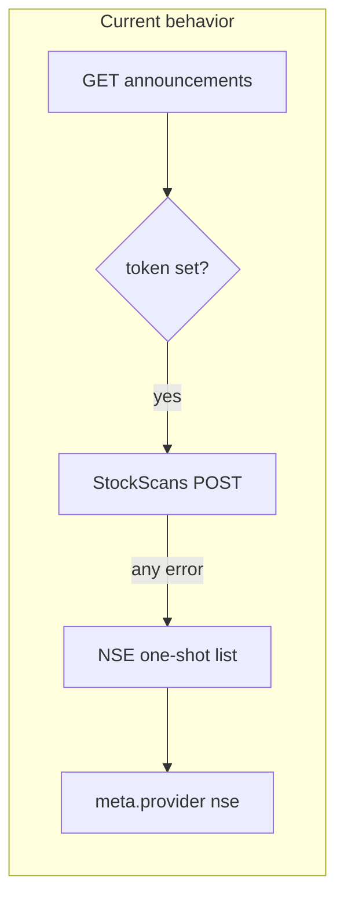

# Announcements: explicit provider + StockScans fixes

## Problem diagnosis

- **[backend/controllers/announcementsController.js](backend/controllers/announcementsController.js)** (`getAnnouncements`): If `STOCKSCANS_AUTH_TOKEN` is set, StockScans is called inside `try/catch`; **any failure logs and falls back to NSE** (lines 80–95, 98–110). NSE returns one finite list (no server-side search/pagination like StockScans), so **bulk “standard pack” over3 years** only sees that small set (e.g. ~9 PDFs after filters)—matching your symptom.
- **[backend/services/stockscansAnnouncements.js](backend/services/stockscansAnnouncements.js)**: For requests with no user search (`< 3` chars), `effectiveSearch` becomes `DEFAULT_ANNOUNCEMENT_SEARCH`, which is **`''`** (line 21) while comments and **[backend/services/**tests**/stockscansAnnouncements.test.js](backend/services/__tests__/stockscansAnnouncements.test.js)** expect a term with length ≥ `MIN_SEARCH_LENGTH` (3). That inconsistency likely triggers StockScans validation errors or poor results, increasing fallback rate.

## Backend changes

1. **Add query parameter `provider`** to `GET /api/announcements/:symbol`:
   - `provider=stockscans`: **Only** call `searchCompanyAnnouncements`. On failure, return an explicit error (e.g. **502** with `meta.provider: 'stockscans'`, message from upstream or token/config). **Do not** call NSE.
   - `provider=nse`: **Only** call `fetchNseCorporateAnnouncements`; never call StockScans.
   - **Optional backward compatibility**: `provider=auto` or omit param → keep today’s “try StockScans then NSE” for any non-UI callers; the **frontend will always send `stockscans` or `nse`** so normal use never auto-falls back.

2. **Fix StockScans default search**: Set `DEFAULT_ANNOUNCEMENT_SEARCH` to a **real broad term with length ≥ 3** (e.g. after a quick check against StockScans behavior, something like `report` or another term that returns a wide set without being too narrow). Ensure the unit test and implementation agree.

3. **Harden error mapping** (if needed after testing): For axios failures (non-JSON body, 401/403/500), normalize messages so the UI can show “invalid/expired token” vs “upstream error” without assuming `body.status === 'error'` only.

4. **Documentation**: Update **[docs/API_REFERENCE.md](docs/API_REFERENCE.md)** (announcements section ~1043+) to describe `provider`, remove/adjust the “always falls back to NSE” wording, and note behavior for `stockscans` vs `nse` vs `auto`.

## Frontend changes

1. **Provider control at top of tab** in **[frontend/components/stock/AnnouncementsTab.js](frontend/components/stock/AnnouncementsTab.js)**:
   - Segmented control or select: **StockScans** | **NSE**.
   - Persist choice in **`localStorage`** (e.g. key `announcementsProvider`) so it survives navigation.
   - When the user changes provider, **clear list, reset offsets, refetch** (same as symbol/search change).

2. **API client**: Extend **[frontend/lib/api.js](frontend/lib/api.js)** `announcementsAPI.getBySymbol` to pass `provider` as a query param when set.

3. **Bulk download**: **[frontend/lib/announcementBulkDownload.js](frontend/lib/announcementBulkDownload.js)** `fetchAllPagesStockScans` / `fetchAnnouncementsForSearchQuery` must pass the same `provider` on every `getBySymbol` call (add optional `provider` argument threaded from `AnnouncementsTab` into `buildStandardPack` / `buildCategoryYearPack` / `buildOrderBookPack`, or a thin wrapper around `announcementsAPI`).

4. **UX copy**: Replace generic “StockScans unavailable” footer with provider-specific hints (NSE: limited list / local filter; StockScans: pagination + server search). When `provider=stockscans` and API returns an error, show the backend message (token / upstream) via existing snackbar/error state—**no silent switch to NSE**.

## Tests

- **Backend**: Controller tests (new or extend existing) for `provider=stockscans` (mock StockScans success/failure—failure must **not** invoke NSE). Adjust **[backend/services/**tests**/stockscansAnnouncements.test.js](backend/services/__tests__/stockscansAnnouncements.test.js)** once `DEFAULT_ANNOUNCEMENT_SEARCH` is fixed.
- **Frontend**: Update **[frontend/components/stock/**tests**/AnnouncementsTab.test.js](frontend/components/stock/__tests__/AnnouncementsTab.test.js)** and **[frontend/lib/**tests**/announcementBulkDownload.test.js](frontend/lib/__tests__/announcementBulkDownload.test.js)** to pass `provider` where needed; add a test that bulk pagination calls include `provider=stockscans` when selected.

## Verification (manual)

- With valid `STOCKSCANS_AUTH_TOKEN`, select **StockScans**, **3y standard pack**: ZIP should include many more PDFs (multiple pages per category).
- Select **StockScans** with bad/expired token: **error UI**, not NSE data.
- Select **NSE**: small list, bulk behavior unchanged but predictable.

## Note on “fix StockScans API”

Code can fix **our** integration (default search, headers, error handling, no silent fallback). **Expired/invalid JWT** still requires refreshing `STOCKSCANS_AUTH_TOKEN` from the browser; the plan includes clearer errors so that is obvious.
