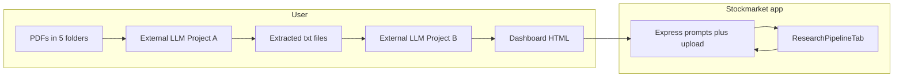

# Institutional equity research pipeline: skills + app integration

## Source of truth

The guide in [`Dashboard_complete_GuideExtraction___Generation_18_04_26_lyst1776605515998.pdf`](Dashboard_complete_GuideExtraction___Generation_18_04_26_lyst1776605515998.pdf) defines:

- **Project A**: Five document categories, unified master extraction prompt, five sequential “advanced” prompts, output filenames (`[TICKER]_AR_Extracts.txt`, etc.), execution order, and extraction principles.
- **Project B**: Prerequisites (`[TICKER]_MasterData.xlsx` from Screener.in + Project A `.txt` files), dashboard master prompt v4.0 (Chart.js 4.4.1 CDN, design tokens, JS rules, 15 tabs / conditional Estimates tab, PRE-GENERATION BRIEF → `GENERATE` gate), and end-to-end workflow (KEC example).

## 1. Agent skills (two projects, not seven separate skills)

Follow [`create-skill` conventions](file:///Users/darshan.patel/.cursor/skills-cursor/create-skill/SKILL.md): concise `SKILL.md` with YAML frontmatter; **full prompts live in companion files** to avoid blowing the context window.

| Skill                      | Path (match existing repo pattern)                                                         | Purpose                                                                                                                                         |
| -------------------------- | ------------------------------------------------------------------------------------------ | ----------------------------------------------------------------------------------------------------------------------------------------------- |
| Equity research extraction | [`.agents/skills/equity-research-extraction/`](.agents/skills/equity-research-extraction/) | When user has PDFs in the five folders, unified or per-type extraction, Indian listed names, forensic AR blocks, concall Q&A, etc.              |
| Equity dashboard generator | [`.agents/skills/equity-research-dashboard/`](.agents/skills/equity-research-dashboard/)   | When user has `.txt` extracts + `MasterData.xlsx`, wants the self-contained HTML dashboard, PRE-GENERATION BRIEF, tab list 0–14, Chart.js rules |

**Each `SKILL.md` should include** (short): folder layout; required inputs/outputs; filename conventions; pointer to `prompts/*.txt` in that skill directory; execution sequence from the PDF; link to troubleshooting ideas (missing folders, image PDFs, partial extracts).

**Prompt files to add under each skill** (verbatim text from the PDF, OCR typos like “9” for “t” can be normalized for readability):

- **Extraction skill**: `prompts/unified_master.txt`, `prompts/annual_reports.txt`, `prompts/concalls.txt`, `prompts/investor_presentations.txt`, `prompts/credit_ratings.txt`, `prompts/events_announcements.txt`
- **Dashboard skill**: `prompts/dashboard_master_v4.txt`

Optional: `references/workflow-checklist.md` summarizing Phase 1–4 from the PDF’s “Complete workflow example.”

**Note:** Project skills live under [`.agents/skills/`](.agents/skills/) alongside existing skills; do not write into `~/.cursor/skills-cursor/`.

## 2. Backend: prompt assets + API

Mirror the existing pattern of [`backend/prompts/order_extraction.txt`](backend/prompts/order_extraction.txt).

- Add [`backend/prompts/institutional-equity/`](backend/prompts/institutional-equity/) with the **same** prompt files as the skills (single source of truth for the running app). Options:
  - **A (recommended):** Keep one copy under `backend/prompts/institutional-equity/` and symlink or document that skills copy from here during updates, **or**
  - **B:** Skills only reference “see `backend/prompts/institutional-equity/`” — slightly worse for agents that only load `.agents/skills/`.

Recommendation: **duplicate into both places** initially (skills for portability; backend for API), with a one-line comment in each skill README that prompts must stay in sync — or a small note in the extraction skill only.

**New routes** (new router mounted in [`backend/server.js`](backend/server.js)):

- `GET /api/research-pipeline/prompts` — JSON manifest: `{ id, label, phase, filename }` for all prompts.
- `GET /api/research-pipeline/prompts/:id` — returns raw text (UTF-8) for copy/download; support optional query `company` & `ticker` to replace placeholders `[Company name]`, `[NSE ticker]` / `[NSE 9cker]` variants from the PDF.

No LLM calls in v1 — aligns with the guide’s Claude.ai workflow.

## 3. Backend: store and serve uploaded dashboard HTML

You chose **upload + view in app**.

- **Storage:** `backend/uploads/research-dashboards/<symbol>/dashboard.html` (or latest timestamped file + `latest` symlink — simplest is **single file per symbol**, overwrite on upload). Add `uploads/` to [`.gitignore`](.gitignore).
- **POST** `multipart/form-data` e.g. `POST /api/stocks/:symbol/research-dashboard` — field `file`, validate `.html` extension and **max size** (e.g. 15–25 MB).
- **GET** `GET /api/stocks/:symbol/research-dashboard` — `Content-Type: text/html; charset=utf-8`, `Content-Disposition: inline` so an iframe can load it. Return 404 if none uploaded.
- **DELETE** (optional) to clear uploaded dashboard.

**Security/practical notes:** This is user-trusted HTML with inline scripts and Chart.js CDN — acceptable for a local/personal screener; document that uploads run with full script capability in the iframe. If the app is ever exposed publicly, add auth and stricter validation.

## 4. Frontend: stock detail integration

[`frontend/pages/stock/[symbol].js`](frontend/pages/stock/[symbol].js) defines tabs (overview, fundamentals, …). Add:

- New tab id `research` / label **Research pipeline**.
- New component e.g. [`frontend/components/stock/ResearchPipelineTab.js`](frontend/components/stock/ResearchPipelineTab.js):
  - **Context:** company name + NSE symbol from existing `basic_info` (pre-fill copy helpers).
  - **Phase 1:** collapsible folder tree checklist (five folders + root `MasterData.xlsx` naming).
  - **Phase 2:** fetch manifest from `GET /api/research-pipeline/prompts`, list Project A prompts with **Copy** (and optional “open in new tab” raw view); show kickoff line template: `Company: …, Ticker: …. Ready to extract.`
  - **Phase 3:** Project B master prompt + attachment list (xlsx + five txt + optional Events/Estimates); remind user of PRE-GENERATION BRIEF → type `GENERATE`.
  - **Phase 4:** file input for `[TICKER]_Dashboard.html`, `POST` to backend, then **iframe** with `src` pointing to the GET URL above (handle empty state + loading/error).

Use existing API helper pattern in [`frontend/lib/api.js`](frontend/lib/api.js) for new endpoints.

## 5. Flow diagram

## 6. Testing and docs

- **Backend:** Jest tests for prompt manifest route (file exists), placeholder substitution, upload validation (reject non-html), GET after POST.
- **Frontend:** Light test or manual QA checklist (copy button, iframe loads).
- **User rule:** Run `yarn test <path>` from repo root for any new tests.

Skip new markdown docs unless you explicitly want README updates; the skills + in-app UI carry the workflow.

## 7. Optional follow-ups (out of scope for first PR)

- Persist multiple dashboard versions per symbol with date labels.
- Anthropic/OpenAI API to run extraction/dashboard inside the app (large product/security/cost surface).
- Generate `MasterData.xlsx` from your Mongo fundamentals (non-trivial vs Screener export shape).
