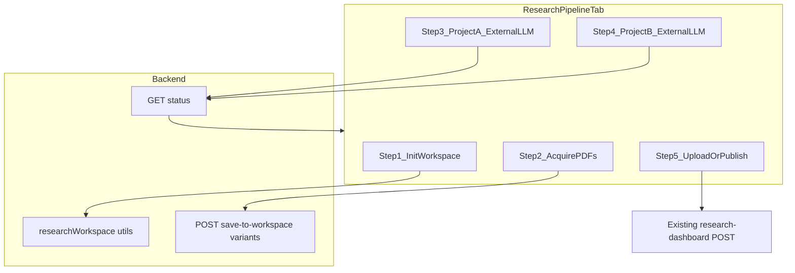

# Research pipeline: deterministic workflow + path alignment

## Current state

- **[`frontend/components/stock/ResearchPipelineTab.js`](frontend/components/stock/ResearchPipelineTab.js)** is a **manual** checklist: static folder list, copy-paste prompts, HTML upload + iframe. No sequential state, no “Proceed”, no server-driven steps.
- **Skills** ([`.agents/skills/equity-research/data-extraction/SKILL.md`](.agents/skills/equity-research/data-extraction/SKILL.md), [`.agents/skills/equity-research/master/SKILL.md`](.agents/skills/equity-research/master/SKILL.md)) expect **`[RESEARCH_ROOT]/[TICKER]/`** with five category folders, root-level `[TICKER]_MasterData.xlsx` and five `[TICKER]_*.txt` files. `RESEARCH_ROOT` defaults to `~/Research` in [`orchestrate.py`](.agents/skills/equity-research/master/scripts/orchestrate.py) (`RESEARCH_ROOT` env).
- **Download APIs** ([`backend/controllers/announcementsController.js`](backend/controllers/announcementsController.js), [`backend/controllers/ordersController.js`](backend/controllers/ordersController.js)) persist to **repo [`downloads/`](backend/utils/repoDownloads.js)** only — not the skill workspace.
- **Bug:** [`orchestrate.py`](.agents/skills/equity-research/master/scripts/orchestrate.py) `acquire` posts to `POST /api/announcements/:symbol/download` **without** the required `announcements` body → always invalid vs [announcements route](backend/routes/announcements.js).
- **Typo:** Phase 3 copy in the tab shows `_Ra9ngReports.txt`; skills use `[TICKER]_RatingReports.txt` ([data-extraction](.agents/skills/equity-research/data-extraction/SKILL.md)). [Dashboard skill](.agents/skills/equity-research/dashboard-generation/SKILL.md) line 17 repeats the typo — fix to `RatingReports` for consistency.

## Target architecture (hybrid milestone)

**Milestone scope (your choice):** automate **deterministic** work and **gating**; **no** server-side LLM calls yet. Optional later: `POST .../run-extraction` using Anthropic/Gemini.

---

## 1. Single path contract: `RESEARCH_ROOT`

- Add **`RESEARCH_ROOT`** to [`backend/.env`](backend/.env) (example: macOS default `~/Research` → expand in Node with `path.resolve` + `os.homedir()` when value starts with `~`).
- New helper module e.g. **[`backend/utils/researchWorkspace.js`](backend/utils/researchWorkspace.js)**:
  - `getResearchRoot()`, `getTickerWorkspace(symbol)`, `ensureLayout(symbol)` — creates `Annual_Reports`, `Concalls`, `Investor_Presentations`, `Credit_Rating_Reports`, `Events_Announcements`, `_cache` (matches [master SKILL Phase 0](.agents/skills/equity-research/master/SKILL.md)).
  - Export **expected filenames** for the five extracts + `MasterData.xlsx` (mirror [data-extraction table](.agents/skills/equity-research/data-extraction/SKILL.md)) so UI and tests stay DRY.

---

## 2. Align downloads with skill folders

**Announcements (Events & announcements PDFs)**

- Refactor PDF fetch logic from [`downloadAnnouncements`](backend/controllers/announcementsController.js) into a small internal **service** (e.g. `services/announcementPdfFetch.js`) that returns buffers + safe filenames (reuse existing axios + naming rules).
- Extend behavior (query flag or **new route** under `/api/research-pipeline/` to avoid breaking existing clients):
  - **`?mode=workspace`** or **`POST /api/research-pipeline/:symbol/events-pdfs`**: after `ensureLayout(symbol)`, write each PDF to **`[workspace]/Events_Announcements/`** with the same naming scheme as today’s ZIP entries (date + subject), and optionally still stream a ZIP to the browser **or** return JSON `{ saved: string[], workspace: string }` for the wizard.
- Keep **existing** `downloads/` ZIP behavior for Announcements/Orders tabs unchanged unless you explicitly want dual-write (recommend: **keep repo `downloads/` for backward compatibility** and add **workspace** as the pipeline’s primary destination).

**Orders / other tabs**

- Do not silently map order PDFs into the five-folder model (ambiguous vs skill). In the wizard, document that **Orders** downloads stay under `downloads/` or user drag-drop into `Concalls/` / `Events_Announcements/` as appropriate — or add a **future** “Import from `downloads/`” step.

---

## 3. Status + init API

New routes under **[`backend/routes/researchPipeline.js`](backend/routes/researchPipeline.js)** (extend [controller](backend/controllers/researchPipelineController.js)):

| Endpoint                                    | Purpose                                                                                                                                                                                                            |
| ------------------------------------------- | ------------------------------------------------------------------------------------------------------------------------------------------------------------------------------------------------------------------ |
| `POST /api/research-pipeline/:symbol/init`  | `ensureLayout`, return absolute `workspace` path (for display)                                                                                                                                                     |
| `GET /api/research-pipeline/:symbol/status` | JSON: folder existence, counts of PDFs per folder, presence of `[TICKER]_MasterData.xlsx`, five `.txt` files, whether [`research dashboard`](backend/controllers/researchDashboardController.js) exists for symbol |

Add Jest coverage alongside [`backend/routes/__tests__/researchPipeline.integration.test.js`](backend/routes/__tests__/researchPipeline.integration.test.js) (mock fs or temp dir).

---

## 4. Frontend: wizard UX

Refactor **[`ResearchPipelineTab.js`](frontend/components/stock/ResearchPipelineTab.js)** (or extract **`ResearchPipelineWizard.js`**) to:

1. **Step 1 — Workspace:** call `init`, show resolved path (same layout text as today but with **actual** `RESEARCH_ROOT` from API). **Proceed** enabled after success.
2. **Step 2 — Acquire PDFs:** buttons that call new workspace-aware download endpoints (reuse announcement list building pattern from [`AnnouncementsTab.js`](frontend/components/stock/AnnouncementsTab.js) only if you need bulk categories — minimum viable: link to Announcements tab + “Save bulk ZIP to workspace” for one chosen bundle, or duplicate slim bulk controls). **Proceed** when `status` shows non-empty `Events_Announcements` (or user override “I placed files manually”).
3. **Step 3 — Project A:** keep **Copy prompt** / Open raw; **Proceed** when `status` reports all five `.txt` present (or partial with explicit “continue anyway”).
4. **Step 4 — Project B:** same for `MasterData.xlsx` + prompts; **Proceed** when user confirms.
5. **Step 5 — View in app:** existing upload + iframe; optional **refresh status** after upload.

Persist **current step** in `localStorage` key e.g. `researchPipelineStep:{symbol}` so refresh does not reset progress.

Extend **[`frontend/lib/api.js`](frontend/lib/api.js)** with `researchPipelineAPI.init`, `status`, and workspace download helpers.

---

## 5. Scripts and skills consistency

- Fix **[`orchestrate.py`](.agents/skills/equity-research/master/scripts/orchestrate.py) `acquire`:** either remove broken `fetch_announcements` or implement: `GET` announcements → build payload → `POST` download (or call new workspace save endpoint). Document **`STOCKMARKET_BACKEND`** / port from stdout.
- Update **[`.agents/skills/equity-research/master/SKILL.md`](.agents/skills/equity-research/master/SKILL.md)** table: Events target is **`RESEARCH_ROOT`-backed workspace**, not raw `downloads/` (only if code changes match).
- Fix **`_Ra9ngReports`** → **`RatingReports`** in dashboard skill and Research tab UI.

---

## 6. Optional follow-up (not in this PR)

- Server-side extraction/dashboard via `@anthropic-ai/sdk` or Gemini using prompts from [`backend/prompts/institutional-equity/`](backend/prompts/institutional-equity/).
- `POST` to run [`compute-schemas`](.agents/skills/equity-research/master/scripts/orchestrate.py) from Node (spawn Python) for Tab-15 gating.

---

## Risk / testing

- **Filesystem permissions:** backend must be allowed to write `RESEARCH_ROOT` (user home). Surface clear API errors if not.
- **Security:** any new route that writes under `RESEARCH_ROOT` must validate `symbol` (alphanumeric) and never take arbitrary paths from clients.
- Run **`yarn test`** for touched backend test paths from repo root per your convention.
