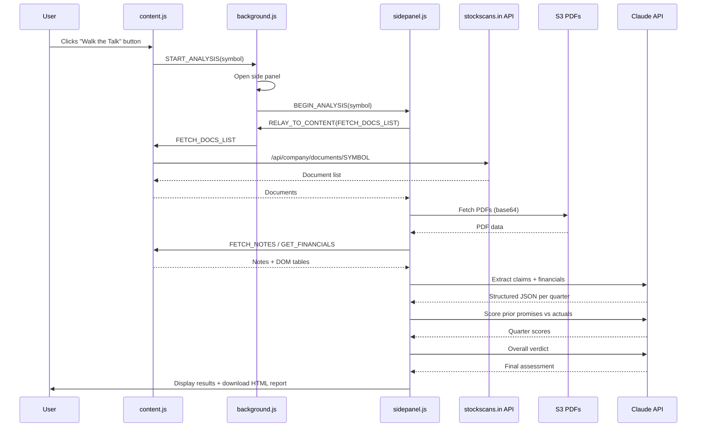

# WTT Extension Improvement Plan

## Task 1: Install Chrome Extension Skills

Install the two most popular Chrome extension skills from the skills ecosystem to guide our refactoring:

```bash
npx skills add mindrally/skills@chrome-extension-development -g -y
npx skills add pproenca/dot-skills@chrome-extension -g -y
```

These provide Manifest V3 best practices, content script optimization rules (MutationObserver over polling, etc.), and error handling patterns.

---

## Task 2: Fix Scoring Mechanism

The scoring pipeline has several bugs that cause it to silently produce empty/meaningless results.

### Issue A: `max_tokens` too low (critical)

In `[sidepanel.js](extensions/wtt-extension/sidepanel.js)` line 119, `max_tokens: 1500` is used for ALL Claude calls -- including the extraction step which returns detailed JSON with arrays of claims + financials. 1500 tokens is roughly ~6KB of text, which is often insufficient for the structured output requested. When the response is truncated, the JSON is malformed and `JSON.parse` fails.

**Fix**: Increase `max_tokens` to `4096` for extraction/scoring calls, or make it a parameter of `callClaude`.

### Issue B: Fragile JSON response cleaning (critical)

Line 127:

`

`

````javascript
return raw
  .replace(/

```json[\s\S]*?

```|

```[\s\S]*?

```/g, (m) =>
    m.replace(/

```json|

```/g, ""),
  )
  .trim();
`

`

````

This regex tries to strip markdown fences but fails when Claude adds preamble text before the JSON block (e.g. "Here is the analysis:"). The preamble survives the regex and causes `JSON.parse` to fail.

**Fix**: Replace with a robust JSON extraction function that:

1. First tries `JSON.parse(raw)` directly
2. If that fails, searches for the outermost `{...}` or `[...]` using brace-matching
3. Falls back to regex extraction from code fences

### Issue C: Silent error swallowing (critical)

Lines 321-324 (extraction) and 380-382 (scoring) catch errors and silently produce empty results:

```javascript
catch(e) {
  allClaims[q.label] = [];
  allFin[q.label]    = {};
}
```

When every quarter silently fails, the final verdict runs on empty data and produces a meaningless score.

**Fix**:

- Add `console.warn` logging in every catch block with the error details
- Track failure count and surface it in the pipeline UI (e.g. "3/6 quarters extracted, 3 failed")
- Consider a simple retry (1 retry per failed call)
- Show a warning in the results if significant data was missing

### Issue D: Claude may return scores as strings

The scoring prompt asks Claude to compute `wtt_score` = `execution_score * 0.5 + language_score * 0.3 + consistency_score * 0.2`, but Claude sometimes returns string values or computes incorrectly.

**Fix**: After parsing the score JSON, coerce all score fields to numbers and recompute `wtt_score` client-side to ensure accuracy:

```javascript
q.execution_score = Number(q.execution_score) || 0;
q.language_score = Number(q.language_score) || 0;
q.consistency_score = Number(q.consistency_score) || 0;
q.wtt_score = Math.round(
  q.execution_score * 0.5 + q.language_score * 0.3 + q.consistency_score * 0.2,
);
```

---

## Task 3: Fix Button Visibility (Desktop Mode)

The "Walk the Talk" button is injected in `[content.js](extensions/wtt-extension/content.js)` lines 96-169. It searches for DOM elements via selectors like `[class*='company-overview']`, `[class*='companyHeader']`, `h1`, etc.

### Root cause

On desktop, the `h1` selector matches, so `inserted` becomes `true`, but the button ends up inside a container with constrained layout (overflow, flex, or specific height) that clips it out of view. The fixed-position fallback never triggers because insertion technically "succeeded."

### Fix approach

1. **Use browser-use subagent** to visit `stockscans.in/company/NSE:INFY` and inspect the actual desktop DOM to find reliable selectors.
2. **Restructure the injection logic**:

- After inserting, verify the button is actually visible (use `getBoundingClientRect()` to check if width/height > 0 and it's in the viewport)
- If not visible, remove it and fall back to the fixed-position strategy
- Add `!important` to key styles to avoid being overridden by the host page

1. **Replace `setInterval` polling** (lines 179-185) with a `MutationObserver` watching for URL changes, per Chrome extension best practices (`content-use-mutation-observer` rule).

---

## Task 4: Write README and Implementation Docs

Create two documentation files:

### A: `extensions/wtt-extension/README.md`

- Extension name, version, purpose
- Architecture diagram (content script / background service worker / side panel)
- Installation instructions (developer mode loading)
- Configuration (API key setup)
- Permissions explained
- Screenshots/workflow description

### B: `extensions/wtt-extension/IMPLEMENTATION.md`

- Detailed data flow: button click -> START_ANALYSIS -> BEGIN_ANALYSIS -> pipeline
- Pipeline steps breakdown (5 steps with inputs/outputs)
- Claude API integration details (model, prompts, token limits)
- Data sources (stockscans API, S3 PDFs, DOM scraping, concall notes)
- Scoring rubric and formula
- Report generation
- Known limitations

---

## Task 5: Enhance, Refactor and Cleanup

### A: Deduplicate `dateToQuarter`

Both `[content.js](extensions/wtt-extension/content.js)` (line 12) and `[sidepanel.js](extensions/wtt-extension/sidepanel.js)` (line 11) have their own `dateToQuarter` implementations. Extract to a shared `utils.js` file and import from both. Note: since this isn't a bundled project, we can use `importScripts` in the service worker or just keep a shared file loaded via manifest.

### B: Add missing icons

The manifest references `icons/icon16.png`, `icons/icon48.png`, `icons/icon128.png` that don't exist. Generate simple gold-themed icons.

### C: Improve `callClaude` robustness

- Accept a `maxTokens` parameter (different calls need different limits)
- Add request timeout handling
- Add proper error classification (rate limit vs auth vs server error)

### D: Content script improvements

- Use `MutationObserver` instead of `setInterval` for SPA navigation detection
- Prefix injected element IDs/classes with `wtt-` to avoid host page conflicts
- Add cleanup on URL change (remove old button before re-injecting)

### E: Side panel UI improvements

- Add a status log/console that shows errors from failed Claude calls instead of silently hiding them
- Show partial results even when some quarters fail
- Add ability to start analysis directly from side panel (not just from button)

### F: Code documentation

- Add JSDoc comments to all functions per project `.cursorrules`
- Add file-level documentation headers

---

## Architecture Overview


